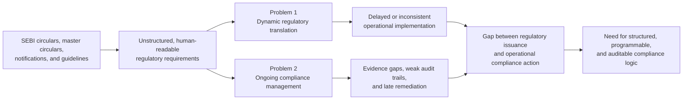
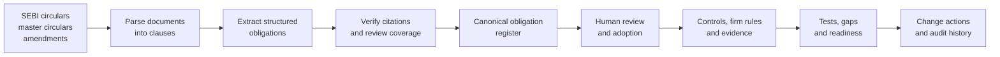
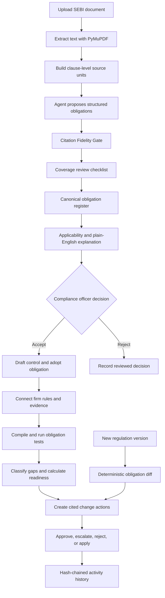
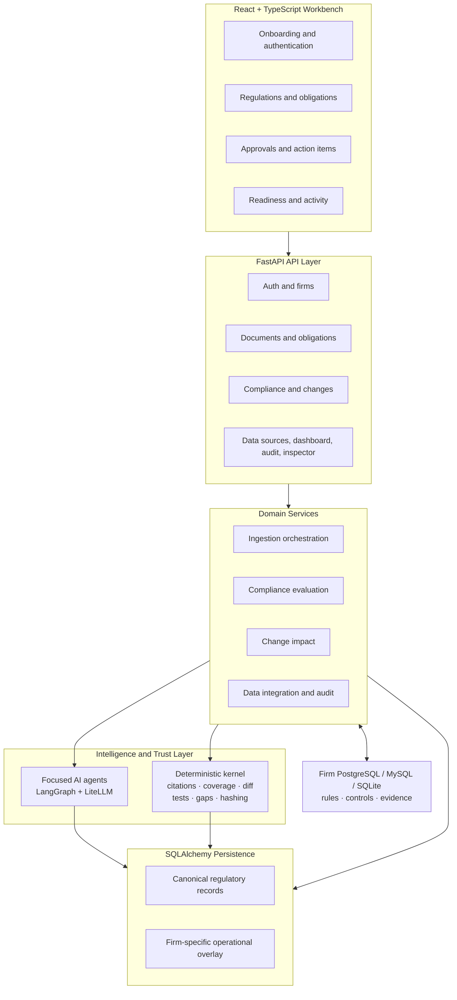
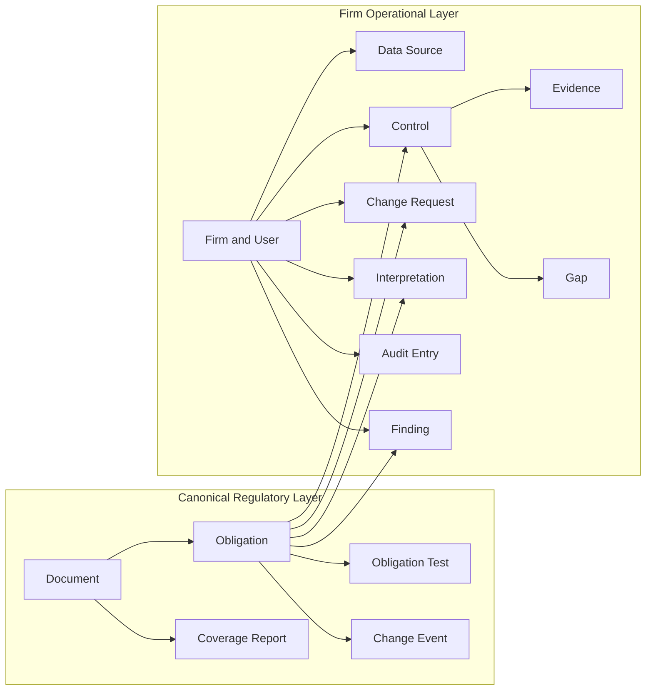
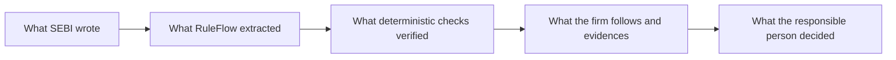

# RuleFlow — Turning SEBI Regulation into Operational Action

**SEBI TechSprint 2026 · Theme 2 — Agentic Compliance**

RuleFlow is the compliance platform we created to convert SEBI circulars, master circulars, and amendments into structured obligations, operational controls, evidence checks, change actions, and an auditable decision trail.

## 1. Problem statement

The securities market ecosystem operates under a continuously evolving regulatory framework. SEBI issues circulars, master circulars, notifications, and guidelines on an ongoing basis, each carrying specific obligations for one or more categories of market intermediaries — stockbrokers, depositories, asset management companies, registrar and transfer agents, investment advisers, and market infrastructure institutions.

This creates **two distinct but deeply related compliance challenges**.

### Problem 1 — Dynamic regulatory translation

The first challenge is interpreting a new or amended regulatory requirement, identifying the intermediary categories it affects, mapping it to operational processes, and updating compliance workflows in a timely and consistent manner.

Today, this depends heavily on manual legal interpretation, internal compliance teams, and circular-by-circular tracking. The result is:

- delayed translation of regulatory text into operational action;
- uneven implementation across affected intermediaries;
- divergent interpretations of the same requirement; and
- difficulty identifying exactly which controls must change when a regulation changes.

### Problem 2 — Ongoing compliance management

The second challenge is managing compliance after an obligation has been identified. Compliance teams must continuously track their existing obligations, connect each obligation to evidence of fulfilment, maintain decision and audit trails, identify compliance gaps, and remediate those gaps before they become regulatory findings.

This work is operationally intensive, often manual, and prone to gaps — particularly for smaller intermediaries with limited compliance resources. Obligations, internal controls, evidence, interpretations, and remediation actions frequently remain spread across PDFs, spreadsheets, emails, and separate operational databases.

### The shared root cause

Both challenges have the same underlying cause: **the regulatory framework exists as unstructured, human-readable text, while operational compliance systems require structured, machine-actionable rules.**



Bridging this gap — transforming regulatory intent into programmable, auditable compliance logic — is the core problem addressed by SEBI TechSprint 2026 Theme 2.

### Desired outcome

The desired outcome is a technology-based solution that demonstrably reduces the gap between regulatory issuance and operational compliance action, or materially improves the efficiency, accuracy, and auditability of compliance management for securities market intermediaries.

The solution must identify the intermediary category and regulatory corpus used and demonstrate its performance through at least one concrete regulatory scenario.

### Our demonstration focus

For our primary hackathon flow, we focus on the **stockbroker** intermediary category and SEBI's publicly available **stockbroker circulars and master circulars** as the regulatory corpus. The same data model also represents obligations applicable to depositories, asset management companies, registrar and transfer agents, investment advisers, and market infrastructure institutions.

Our concrete scenario follows a new or amended stockbroker requirement from document upload to clause-level extraction, citation verification, applicability, human adoption, control mapping, firm-database comparison, evidence testing, gap identification, and a cited remediation action.

## 2. Our solution

We created **RuleFlow** as a connected regulation-to-action system. It reads regulatory documents clause by clause, proposes structured obligations, verifies every citation against the source text, highlights duty language that still needs review, and carries accepted obligations into the firm's controls, evidence, readiness, and change-management workflows.

Our core design principle is:

> **Agents propose. Deterministic code verifies. Humans decide.**



RuleFlow connects four things that compliance teams usually manage separately:

1. **What SEBI wrote** — the authoritative document, clause, quotation, and source identity.
2. **What the regulation requires** — a structured, reviewable obligation with modality, trigger, deadline, periodicity, threshold, and applicability.
3. **What the firm does** — its adopted rules, operational controls, connected data, and evidence.
4. **What happens next** — a human decision, remediation action, compliance result, or recorded change.

## 3. How we are solving it

We divided RuleFlow into three clear responsibility layers.

### 3.1 Agents understand regulatory language

Focused agents handle tasks where language understanding matters. They extract obligations, assess applicability, explain clauses, identify cross-references, draft controls, discover firm rules, analyse change impact, explain readiness, and prepare inspection observations.

Each agent receives a bounded task and returns structured data. The prompts are centralized in the codebase, making the instructions behind each result inspectable.

### 3.2 The verification kernel establishes trust

Our deterministic Python kernel handles every check that can be calculated exactly. It verifies citations, reviews coverage signals, compares obligation versions, compiles evidence tests, classifies compliance gaps, calculates transparent readiness inputs, and builds hash-chain values for the audit history.

This gives the platform reproducible results for source matching, dates, thresholds, structural differences, test outcomes, and audit integrity.

### 3.3 Humans own the decisions

Compliance officers see the source quote beside the normalized obligation and can accept or reject the proposal. Change actions can be approved, escalated, rejected, and marked as applied. Judgement-based requirements remain visible for human attestation.

The system accelerates the work while keeping interpretation, adoption, and remediation decisions accountable.

## 4. End-to-end RuleFlow workflow



### Step 1 — Establish the firm context

A user registers a firm with its intermediary category and optional tier. This context supports applicability analysis, obligation suggestions, dashboard calculations, and firm-scoped workflows.

RuleFlow can connect to an existing PostgreSQL, MySQL, or SQLite database. It tests the connection, reflects the available schema, and records the tables that can participate in rule discovery, evidence import, and adopted-obligation write-back.

### Step 2 — Ingest and structure a regulation

A user uploads a SEBI PDF. The backend processes it in stages while the frontend displays parsing, extraction, enrichment, coverage, obligation counts, failed-clause counts, and completion progress.

The ingestion flow:

- extracts document text with PyMuPDF;
- creates clause-level units with character offsets;
- preserves source identity through normalized content hashes;
- processes each clause independently; and
- stores document status and analysis results for later review.

### Step 3 — Extract obligations

The Extraction Agent converts regulatory language into structured proposals containing:

- clause path;
- verbatim regulatory quotation;
- normalized obligation statement;
- modality such as `shall`, `may`, or `best_judgment`;
- trigger condition;
- deadline or periodicity;
- numeric threshold; and
- citation metadata.

A focused quote-correction pass handles grounding failures, and deterministic similarity logic collapses near-duplicate proposals from the same clause.

### Step 4 — Verify citations and review coverage

The Citation Fidelity Gate re-reads the cited character range from the authoritative document. It checks in-order token support and source-hash identity, then records the fidelity result. The default grounding threshold is **0.95**.

The coverage kernel scans the complete document for duty phrases such as `shall`, `must`, `required to`, and `shall not`. It turns those signals into a reviewer checklist showing which regulatory sentences are represented by extracted obligations and which ones still require attention.

### Step 5 — Build and review the obligation register

Obligations are stored in a searchable canonical register with their source document, clause, quote, modality, structured attributes, applicability, verification state, and lifecycle status.

RuleFlow can produce a plain-English explanation with a summary, key actions, likely applicability, and regulatory importance. Compliance officers then accept or reject the obligation with the complete source context visible.

### Step 6 — Turn accepted obligations into controls

For an accepted obligation, RuleFlow can draft an operational control containing a description, control type, owner role, and frequency. It creates the firm-specific mapping and writes adopted records to a dedicated `ruleflow_adopted_obligations` table in the connected database.

The write-back flow is namespaced and idempotent. Internal decisions and external synchronization outcomes remain visible as separate records, preserving the officer's work throughout the process.

### Step 7 — Connect firm rules and evidence

RuleFlow reflects the connected database and identifies likely rule, policy, control, limit, and threshold data. Every proposed database rule is validated against the reflected source table before it enters the **Rules You Follow** view.

Evidence can be imported from a selected table and linked to controls. RuleFlow retains the capture time, source, content hash, and available numeric metrics so that evidence remains traceable to its operating system.

### Step 8 — Test obligations and classify gaps

Crisp obligations are compiled into inspectable JSON test specifications:

- **Presence** — required evidence exists.
- **Recency** — the newest evidence is within the permitted age.
- **Periodicity** — evidence exists for the required cycle.
- **Deadline** — evidence was captured by the due date.
- **Threshold** — a recorded metric satisfies the regulatory condition.

The test engine produces green, amber, red, or human-attested outcomes. The gap ledger then classifies issues as missing, stale, weak, or contradictory and derives severity from the obligation modality, failure reason, and test status.

### Step 9 — Measure readiness

The readiness workflow combines grounded operating inputs:

- rules discovered in the firm's database;
- SEBI obligations applicable to the firm;
- obligations addressed through mapped controls;
- evidence-backed test results; and
- unresolved change actions affecting followed rules.

These inputs produce dashboard metrics and an explainable readiness narrative for compliance teams and management.

### Step 10 — Manage regulatory change

The deterministic diff engine compares obligation sets across document versions. It matches clause paths, detects moved or renumbered clauses through similarity, and records added, amended, removed, and unchanged obligations with field-level differences.

RuleFlow also compares the firm's followed rules with current SEBI obligations. A change action is retained only when it connects a real rule from the firm's data to a real stored obligation. The resulting action includes the regulatory citation, observed mismatch, recommended response, and human decision status.

### Step 11 — Preserve history and accountability

Obligations and evidence include valid-time and recorded-time fields that support point-in-time compliance evaluation.

Major workflow events create audit entries containing the actor, action, payload, previous chain hash, timestamp, and new chain hash:

```text
chain_hash = SHA256(previous_chain_hash + canonical_payload + timestamp)
```

The chain can be re-derived to verify the integrity of the recorded activity history, while the frontend presents the events in language that compliance users can understand.

## 5. Product experience we created

The React application gives each workflow a dedicated working surface.

### Public and onboarding experience

- product landing page;
- firm and account registration;
- authenticated login and session restoration; and
- optional data-source connection during onboarding.

### Compliance workspace

- **Overview** — readiness, rules followed, obligations in scope, addressed obligations, regulations, action items, risks, and recent documents.
- **Regulations** — PDF upload, multi-stage processing progress, document status, obligation counts, and analysis results.
- **Obligation Register** — search, filters, source context, modality, verification state, exact quote, and plain-English explanation.
- **Approvals** — pending, accepted, and rejected obligations with control creation and synchronization feedback.
- **Action Items & Database Rules** — rules discovered in firm data, circular-scoped comparisons, cited impacts, and governed decisions.
- **Compliance & Rule Suggestions** — grounded category-relevant obligations grouped by regulation for individual or bulk review.
- **Activity** — searchable history of uploads, connections, evidence imports, adoption, calculations, and change decisions.
- **Settings** — firm profile, connection testing, schema visibility, and connected-source status.

The codebase also contains a thematic Inspector workflow. It prepares SEBI-style observations from stored obligations and compliance results, validates every cited obligation, and links findings to the evidence-backed compliance state.

## 6. System architecture



### Frontend layer

React, TypeScript, React Router, TanStack Query, Tailwind CSS, Framer Motion, Recharts, and shared UI components provide the end-user workflows, protected routes, query state, progress visualization, and dashboard experience.

### API layer

FastAPI routers expose authentication, documents, obligations, firms, compliance, change requests, data sources, dashboard, inspector, and audit operations. Request and response models are defined through Pydantic schemas.

### Service layer

Domain services coordinate ingestion, agent calls, deterministic checks, persistence, external database access, progress state, change analysis, compliance evaluation, and audit recording. Business workflows remain organized independently from HTTP routing.

### Intelligence and trust layer

LangGraph coordinates clause-level extraction and enrichment. LiteLLM provides a provider-independent model interface. The deterministic kernel verifies and computes the trust-critical results that feed the workflow.

### Persistence and integration layer

SQLAlchemy stores canonical regulatory knowledge and firm-specific operating records. Schema reflection connects RuleFlow to a firm's existing PostgreSQL, MySQL, or SQLite data for rule discovery, evidence import, and adopted-obligation synchronization.

## 7. Agent architecture

We use focused agents with narrow responsibilities and explicit validation boundaries.

| Agent capability | Responsibility | Validation path |
|---|---|---|
| Extraction | Convert one clause into structured obligation proposals | Citation gate, quote-correction pass, deterministic de-duplication |
| Applicability | Suggest relevant intermediary categories and surface ambiguity | Firm context and visible human review |
| Cross-reference | Identify referenced paragraphs and schedules | Literal reference validation against input text |
| Control drafting | Turn an accepted obligation into an operational control | Stored obligation fields and structured fallback |
| Obligation explanation | Present the requirement in plain language | Grounded obligation context and structured fallback |
| Database rule extraction | Discover rules represented in connected firm data | Reflected-table validation |
| Followed-rule impact | Relate a firm rule to a current SEBI obligation | Exact firm-rule and stored-obligation validation |
| Readiness scoring | Explain readiness using operating counts and risks | Transparent computed inputs |
| Inspector | Prepare thematic observations and recommendations | Stored-obligation and compliance-result validation |

## 8. Deterministic compliance kernel

The kernel gives RuleFlow a reproducible trust boundary.

| Kernel capability | What it produces |
|---|---|
| Citation fidelity | Source-span matching, token-support score, document-hash validation, and grounding state |
| Coverage review | Duty-language signals, accounted sentences, and reviewer attention items |
| Version diff | Added, amended, removed, unchanged, moved, and renumbered obligation relationships |
| Obligation tests | Presence, recency, periodicity, deadline, and threshold test specifications and results |
| Gap ledger | Missing, stale, weak, and contradictory classifications with deterministic severity |
| Content hashing | Stable normalized document identity |
| Audit hashing | Canonical payload serialization, chained hashes, and chain-integrity verification |

## 9. Data architecture

We structured the data model around a shared regulatory truth and a separate firm operating context.



### Canonical regulatory records

- **Document** — circular metadata, content identity, source text, processing status, and page count.
- **Obligation** — source quote, normalized duty, structured attributes, applicability, citation fidelity, lifecycle, and time fields.
- **ObligationTest** — compiled test specification and latest result metadata.
- **CoverageReport** — signal-level review checklist for a document.
- **ChangeEvent** — obligation-level difference between regulation versions.

### Firm-specific operating records

- **Firm and User** — intermediary context, tier, account identity, and role data.
- **DataSource** — connected database type, connection state, reflected details, and synchronization time.
- **Control** — the firm's operational response and obligation mappings.
- **Evidence** — proof or metrics connected to a control with source and time metadata.
- **Gap** — classified deficiency, severity, and remediation state.
- **ChangeRequest** — cited action item and its decision lifecycle.
- **Interpretation** — firm-specific notes and sources for an obligation.
- **AuditEntry** — actor, action, payload, before/after state, and hash-chain fields.
- **Finding** — thematic inspection observation, severity, citation, and recommendation.

This model lets the regulatory source remain canonical while adoption, controls, evidence, interpretations, actions, and decisions remain specific to each firm.

## 10. Security, governance, and traceability

We built governance into the workflow through:

- PBKDF2-HMAC-SHA256 password hashing with random salts;
- signed, expiring HMAC-SHA256 bearer sessions;
- authenticated firm context for operational workflows;
- `firm_id` scoping across firm records and services;
- source quotes, clause paths, offsets, hashes, and fidelity results;
- reflected-schema validation before firm database rules are accepted;
- dedicated namespaced storage for adopted-obligation write-back;
- visible synchronization and processing outcomes;
- human decisions for obligation adoption and change actions; and
- a verifiable hash-chained activity ledger.

These controls create a traceable path from regulatory text to the person, control, evidence, result, and action associated with it.

## 11. Technology stack

### Backend

- Python 3.12
- FastAPI
- Pydantic and pydantic-settings
- SQLAlchemy 2.0
- PostgreSQL and SQLite persistence paths
- Psycopg for PostgreSQL connectivity
- PyMuPDF for PDF extraction
- LangGraph for agent orchestration
- LiteLLM for provider-independent model access
- Structlog for structured logging
- Pytest for kernel, service, API, authentication, and integration validation

### Frontend

- React 18
- TypeScript
- Vite
- Tailwind CSS
- React Router
- TanStack Query
- Framer Motion
- Recharts
- Lucide React

### Firm-system integration

- PostgreSQL
- MySQL
- SQLite
- SQLAlchemy schema reflection and data access

## 12. Business and regulatory impact

### Impact at a glance

| Compliance activity | Existing manual approach | RuleFlow-assisted approach | Indicative business impact |
|---|---|---|---|
| Extract obligations from a 30–60 page circular | Approximately 16–24 analyst-hours across reading, interpretation, and structuring | Automated clause-level extraction in minutes, followed by focused officer review in under 1 hour | **~95% reduction in first-pass analysis effort** |
| Compare a new circular or amended version with the previous regulatory position | Approximately 4–8 hours of line-by-line and spreadsheet comparison | Deterministic obligation-level diff produced in seconds | **~99% faster regulatory change comparison** |
| Process 50 relevant circulars in one year | Approximately 100–150 analyst-days of manual reading and comparison | Automated processing with approximately 6–7 analyst-days of focused review | **100+ analyst-days saved per year** in the modelled scenario |
| Check whether duty language may have been missed | Reviewer-dependent manual re-reading with no consolidated checklist | Document-wide duty-signal scan with every detected signal shown as accounted or requiring review | **A new, explicit coverage-review capability** |
| Trace a requirement to its operational response | Search across PDFs, spreadsheets, email, controls, and evidence repositories | Direct chain from source quote to obligation, control, evidence, gap, action, and decision | **Faster audit and inspection preparation** |
| Identify which existing firm rules are affected by a regulatory change | Manual coordination between legal, compliance, operations, and technology teams | Grounded comparison between stored SEBI obligations and rules read from the firm's database | **Earlier, more focused remediation** |

> **Impact model:** These figures are scenario-based hackathon estimates derived from the workflow assumptions below. They communicate the expected operational value of the implemented system and should be validated through a formal pilot on a representative regulatory corpus.

### How we derived the headline figures

| Headline | Calculation |
|---|---|
| **~95% reduction** | A midpoint manual baseline of 20 analyst-hours reduced to 1 hour of focused review: `(20 - 1) / 20 = 95%`. |
| **~99% faster diff** | A conservative 4-hour manual comparison reduced to no more than 1 minute of deterministic processing: `(240 - 1) / 240 = 99.58%`. |
| **100+ analyst-days saved** | `50 circulars × 2.5 analyst-days = 125 days` manually. At 1 review hour per circular, assisted review is approximately `50 / 8 = 6.25 days`, releasing approximately **118.75 analyst-days** for higher-value compliance work. |

The model assumes an eight-hour analyst day, a 30–60 page regulatory document, two to three analyst-days for manual interpretation and structuring, no more than one hour for focused review after extraction, and 50 relevant circulars or amendments in a year.

### For compliance teams

RuleFlow shortens the path from receiving a circular to reviewing its operational implications. Officers work with structured obligations, exact source quotations, coverage-review signals, firm rules, controls, evidence, gaps, and action items in one connected flow.

The time released from repetitive reading, copying, and comparison can be redirected to interpretation, exception handling, control design, and remediation.

### For control owners and management

The platform shows which obligations are in scope, which controls address them, what evidence supports them, where action is required, and who owns the next decision. Readiness is built from stored operating data and traceable calculations.

This gives management a clearer view of compliance exposure and helps control owners prioritize changes according to regulatory impact.

### For audit and inspection preparation

RuleFlow creates citation-grounded obligation records, repeatable evidence tests, point-in-time compliance views, thematic findings, human-readable activity history, and hash-chain integrity verification. This creates a defensible path from source requirement to operating response.

### For regulated intermediaries

The canonical-plus-firm-overlay model supports consistent regulatory interpretation while preserving each firm's own category, controls, evidence, and decisions. Existing databases become part of the workflow through reflected rule discovery and evidence import.

The reduction in repeated manual work is especially valuable for smaller intermediaries that must meet the same regulatory expectations with more limited compliance resources.

### For the regulatory ecosystem

Machine-actionable obligations, structured changes, grounded citations, and consistent evidence relationships can make regulatory communication easier to interpret, operate, review, and inspect across different types of intermediaries.

## 13. Alignment with SEBI TechSprint 2026 Theme 2

| Theme 2 need | What we created in RuleFlow |
|---|---|
| Translate regulatory text | Clause-level extraction into structured obligations |
| Preserve regulatory rigor | Verbatim quotes, offsets, source hashes, and citation fidelity |
| Review extraction coverage | Duty-signal checklist across the complete document |
| Make obligations operational | Human adoption, drafted controls, and firm-specific mappings |
| Connect with firm reality | Database reflection, followed-rule discovery, and evidence import |
| Evaluate compliance | Compiled tests, point-in-time evaluation, and deterministic gap classification |
| Respond to regulatory change | Version diffing, followed-rule impact analysis, and cited action items |
| Keep decisions accountable | Accept, reject, approve, escalate, apply, and close workflows |
| Support auditability | Source-linked records and a verifiable hash-chained activity trail |

RuleFlow turns Theme 2 into an end-to-end operating model: **regulation in, grounded obligation out, operational evidence connected, human action recorded.**

## 14. Validation in the repository

The backend test suite exercises the trust-critical kernel, service, API, authentication, and integration paths. It covers:

- citation fidelity and source grounding;
- coverage-signal accounting;
- obligation-version diffing;
- obligation-test compilation and evaluation;
- deterministic gap classification;
- adoption-driven compliance scope;
- evidence-based green and red outcomes;
- category-based obligation suggestions;
- point-in-time evaluation;
- change requests and human decisions;
- audit-chain integrity;
- account registration, login, and authenticated identity;
- SQLite data-source connection and evidence import; and
- plain-English explanation fallback behavior.

This validation keeps the exact, testable parts of compliance processing reproducible throughout the application.

## 15. Repository structure

```text
backend/
  app/
    agents/          focused extraction, reasoning, scoring, and inspection agents
    api/             FastAPI routers
    db/              SQLAlchemy base, initialization, and domain models
    ingest/          PDF parsing and clause structuring
    kernel/          citation, coverage, diff, gaps, tests, and hashing
    llm/             provider-independent LiteLLM client
    schemas/         request and response models
    services/        ingestion, compliance, change, audit, and data-source workflows
    main.py           application composition and router registration
    security.py       password hashing and signed session tokens
  tests/              kernel, API, service, authentication, and integration tests

frontend/
  src/
    components/       layout, workflow visualization, guards, motion, and shared UI
    lib/              API client, authentication, firm context, and utilities
    pages/            public pages and compliance workflows
    App.tsx           routes and protected workspace structure
    index.css         global design system and Tailwind styles
```

## 16. The outcome

We created RuleFlow to make the journey from regulatory text to operational compliance visible, structured, and accountable.



Agents give us speed and language understanding. The deterministic kernel gives us reproducibility and traceability. Connected firm data gives us operational context. Human review gives every important decision an accountable owner.

That is the system we built for SEBI TechSprint 2026 Theme 2.